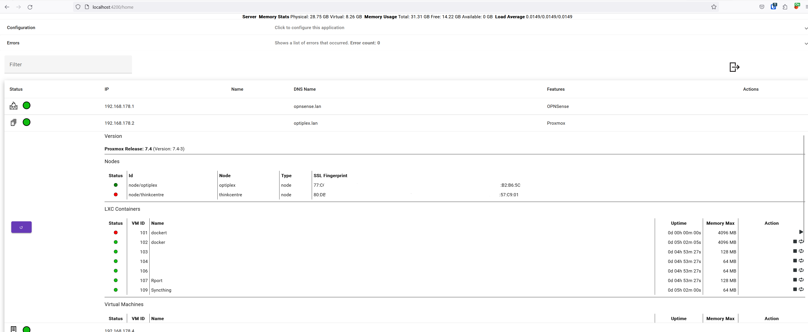
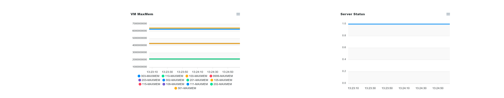

# Homelab Server Manager

## Description

The aim of this project is to give users a consolidated view on their servers and devices in their homelab.
In addition to monitoring functionality, it should be also possible to perform actions on these servers/devices like starting with Wak-on-Lan or restarting VMs of a Hypervisor.

All this should be extesible by simple plugins, which are currently defined as JSON files that include all necessary links and parameter definitions.
There can be also conditions defined when a action is possible to execute and which data is relevant for the condition. The conditions can be checked with simple scripts in a script languge (currently LUA and RHAI are supported).
In addition to these definitions, there can be templates linked which convert XML/JSON output into nice looking HTML output for display.

And since I'm lazy, I tried to automate everything as much as possible. For example, the servers, devices and their features can be auto-discovered by using ping, DNS queries, UPnP decvice discovery. Also local running Docker containers can be discovered by using the Docker Socket API.
In addition to that, each plugin can give the manager the information how and where a feature can be detected (ie. by grabbing information from a status page).

Currently working Plugins/Features:

- OpnSense Firewall query
- Proxmox Hypervisor data query and VM/LXC control
- Local Docker (by using the local Docker Socket connection)
- Wake-on-Lan
- Sleep-on-Lan
- UPnP device information query
- Tasmota (query data, power switch of power outlets)
- PiHole data query

## The technology stack

### Frontend

- Typescript
- Angular with RxJS
- Angular Material
- Apex Charts with Angular integration

### Backend

- REST API Server (most parts secured by API token)
- Written in Rust
- Using SqlX, Actix-Web, Tokio, lettre, rlua, rhai and many more crates
- Handlebars template engine for JSON/XML to HTML conversion
- Databases: SQLite for config and QuestDB for timeseries data
- For Plugins: Definition in JSON and scripts in LUA/RHAI
  
### Docker Config

The server manager can be executed as a docker container by using this docker-compose.yml (it also starts a [QuestDB](https://questdb.io) - for timeseries data persistence):

    version: "3"
    services:
      timeseriesdb:
        image: questdb/questdb:latest
        container_name: server-manager-questdb
        restart: always
        # should only be accessible for the host itself, so we bind it to localhost
        environment:
          - QDB_HTTP_BIND_TO=127.0.0.1:9000
        # network also has to be host here - cannot combine bridge and host network. And the server has to stay in network mode host due to Wake On Lan - see comment for server container
        network_mode: host       
        
        
      server:
        image: docker.registry.lan:5000/afoxdocker/docker-server-manager
        container_name: server-manager
        environment:
           - USER_UID=1000
           - USER_GID=1000
        restart: always
        # if you want to use wake on lan actions, the network_mode has to be host
        # consequence -> if "network_mode: host" the port mapping doesn't work. You need to change the port of the internal server in the .env file in the config folder
        network_mode: host
        volumes:
          - ./config:/external_files
          - ./log:/var/log
          - /etc/timezone:/etc/timezone:ro
          - /etc/localtime:/etc/localtime:ro
          - /var/run/docker.sock:/var/run/docker.sock

### first startup / directory structure

After the first startup, the following folder hierarchy is created which contains a .env config file and the folders for the plugins/templates where users can extend the manager with custom plugins:

    ./config
          /plugins
          /templates
          .env
          server-manager.db

### .env Configuration

    # Log level of the application
    RUST_LOG=warn

    # URL and port where the http server binds to
    BIND_ADDRESS=0.0.0.0:8088
    
    PLUGIN_BASE_PATH=external_files/plugins
    TEMPLATE_BASE_PATH=external_files/templates/

    # Deactivate if are using only SSL certificates which are signed by a public authority
    ACCEPT_SELF_SIGNED_CERTIFICATES=true

    SESSION_SECRET_KEY=<a unique generated secret key - do not delete since already encrypted data cannot be decrypted anymore>

    SMTP_HOST=<your mail server>
    SMTP_USERNAME=<the user name for your mail server>
    SMTP_PASSWORD=<the password for your mail server>
    EMAIL_FROM=<the from address that will be used to send mails>

Some notes:

- Passwords/credentials can be marked in the plugin so that they are automatically encrypted
- Passwords are not sent cleartext - even if the web server is running only via HTTP, since there is an internal AES-GCM encryption for sensitive data with a one-time encryption key that always changes  <em>**(ToDo: Also encrypt credentials between frontend and backend)**</em>
- User Passwords for the application itself are not stored as cleartext but using bcrypt hashes

#### My ToDo list (not ordered by priority)

- [x] Docker plugin for Socket based installation on the same host (done)
- [ ] Docker plugin for port based connection for supporting remote docker installations
- [ ] Extract more data for existing plugins
- [ ] Control UPnP devices with their exposed actions
- [x] Store received information as time series and build graphs (done - it uses [Apex](https://apexcharts.com/) charts for display and [Quest DB](https://questdb.io/) as database)
- [ ] more Plugins (nearly everything that offers a REST, SOAP API is possible) CrowdSec, PfSense and many more is possible...
- [ ] maybe build an agent that can be installed on remote machines to get information from the OS or installations like Wireguard, that offer no direct API
- [ ] encrypt other passwords/credentials between frontend and backend

## How the main screen looks like and the output from the Proxmox plugin

## Docker containers gathered by local socket connection on the same host

## Pi-Hole

## This is how the switch and information of a Tasmota device looks like

## This is how a UPnP device is showing it's data

## Monitoring / Charts

